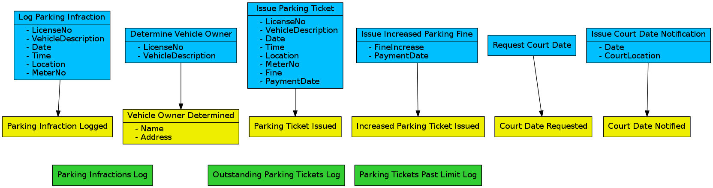

# Event Storming

A way to abstract the key events in a system, in this
case the somewhat less than happy case where a car owner
has decided to fight a traffic ticket and needs to take
a personal day to attend traffic court.

## Introduction

The following web page gives a nice introduction:

	http://webeventstorming.com/

Their tool (which I beta-tested to a small degree) does
a nice job of compressing white space as necessary while
respecting places where it is needed for readability.

## SEDA

Please refer to the [SEDA folder](SEDA/) for information
on SEDA (Staged Event-Driven Architecture).
